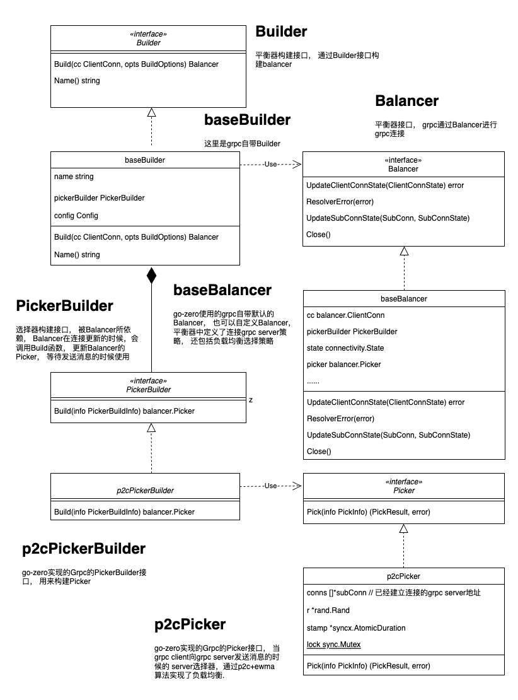

# go-zero 微服务负载均衡


go-zero中的负载均衡本质上是利用了grpc的提供的客户端负载均衡的能力来实现负载均衡的， grpc本身提供了常用的两种负载均衡的策略：weightedroundrobin、roundrobin，并且向外提供了负载均衡的插件式编程，  go-zero通过实现grpc插件的方式， 实现了自定义负载均衡。


## go-zero负载均衡算法

go-zero 采用了p2c+EWMA的算法来实现负载均衡， 目的是每次通讯选择的都是负载最低， 响应最快的节点处理请求.

* p2c

p2c(Pick Of 2 Choices)二选一: 在多个节点中随机选择两个节点。

* EWMA

EWMA（Exponential Weighted Moving Average）算法用于计算一组数据的加权移动平均值，其中每个数据点的权重随时间指数衰减。

公式： 


1. Vt代表第t次请求时的EWMA值，Vt-1代表第t-1次请求的EWMA值
2. θt代表第t次请求的实际耗时，所以β越小，Vt越接近本次请求耗时

* EWMA优势

Vt ≈ 1/(1 - β) 次的平均耗时

当β 越大时，代表计算的范围越大，Vt很好地体现了平均值，但是对于毛刺越不敏感（但仍然优于算数平均）；

当β 越小时，代表计算的范围越小，对于毛刺越敏感，但是对平均值体现不佳；

1. 内存占用 ：算数平均需要存储从开始到现在所有的数据，占用较大；EWMA只记录前一次数据和当前数据，占用较小 ；
2. 对毛刺敏感程度：算数平均对于毛刺的不敏感，使得网络抖动无法体现在latency中；EWMA可以通过调整β来控制需要计算的区间范围（最近几次请求）

* EWMA中的β取值

牛顿冷却定律中的衰减函数模型进行β计算

```
β = 1/e^(k*△t) 
```
其中△t为网络耗时，e，k为常数


## go-zero 负载均衡

1. go-zero实现了Grpc的PickerBuilder和Picker接口

* UML类图




2. 负载均衡的注册

通过Balancer注册， go-zero将自定义负载均衡注入grpc

zrpc/internal/balancer/p2c/p2c.go中

构建grpc Balancer， 使用grpc默认的baseBalancer， 将p2cPickerBuilder给到默认的baseBalancer， baseBalancer默认的连接策略是对grpc server地址全部连接， 在发送消息的时候，会使用p2cPickerBuilder构建的Picker， 也就是p2cPicker


```
// 注册Balancer到grpc的全局变量balancer map中
func init() {
	balancer.Register(newBuilder())
}

// 将自定义p2cPicker和p2cBuilder嵌入到Builder和Balancer
func newBuilder() balancer.Builder {
	return base.NewBalancerBuilder(Name, new(p2cPickerBuilder), base.Config{HealthCheck: true})
}
```


这里使用grpc-go中的自带baseBalancer，其函数UpdateClientConnState会默认和所有的grpc server连接， UpdateClientConnState在和grpc server建立连接以后， 会调用UpdateState， 更新连接状态，并且更新Picker， 即go-zero自定义的p2cPicker， 以供负载均衡的时候调用.


3. 负载均衡的实现

go-zero主要实现了Picker接口， 通过grpc-go自带Balancer将实现的Picker接口注入， 以供grpc的Balancer调用.

zrpc/internal/balancer/p2c/p2c.go中 

* 主要结构

```
// 实现了Picker
type p2cPicker struct {
	conns []*subConn            // 已经建立连接的grpc链接信息
	r     *rand.Rand            // 随机数生成器,用来从子连接列表中随机选择两个候选者
	stamp *syncx.AtomicDuration // 原子时长,用来记录上一次更新子连接列表的时间戳
	lock  sync.Mutex            // 互斥锁
}

// 保存链接的信息， 用于计算保存ewma值
type subConn struct {
	lag      uint64           // 用来保存 ewma 值
	inflight int64            // 用在保存当前正在使用此连接的请求总数
	success  uint64           // 用来标识一段时间内此连接的健康状态
	requests int64            // 用来保存请求总数
	last     int64            // 用来保存上一次请求耗时, 计算 ewma 值
	pick     int64            // 用来保存上一次被选中的时间点
	addr     resolver.Address //用来保存连接的地址,包含了IP、端口、元数据等信息
	conn     balancer.SubConn //用来保存连接的连接对象,用来发送和接收请求
}
```


* p2cPickerBuilder的Build函数实现

```
// UpdateClientConnState在和grpc server建立连接以后， 会调用grpc中regeneratePicker， 这个函数会调用Build， 这里可以拿到ReadySCs， ready subConnects， 所有已经建立的链接
func (b *p2cPickerBuilder) Build(info base.PickerBuildInfo) balancer.Picker {
	readySCs := info.ReadySCs
	if len(readySCs) == 0 {
		return base.NewErrPicker(balancer.ErrNoSubConnAvailable)
	}

	var conns []*subConn
	// 构建subConn slice
	for conn, connInfo := range readySCs {
		conns = append(conns, &subConn{
			addr:    connInfo.Address,
			conn:    conn,
			success: initSuccess,
		})
	}
	// 构建p2cPicker
	return &p2cPicker{
		conns: conns,
		r:     rand.New(rand.NewSource(time.Now().UnixNano())),
		stamp: syncx.NewAtomicDuration(),
	}
}
```

* Picker接口的Picker函数实现

```
// 负载均衡策略，p2c， 发送消息的时候会调用这个Pick函数选择发送的server，进行负载均衡
func (p *p2cPicker) Pick(_ balancer.PickInfo) (balancer.PickResult, error) {
	p.lock.Lock()
	defer p.lock.Unlock()

	var chosen *subConn
	switch len(p.conns) {
	case 0:
		// 没有节点， 返回错误
		return emptyPickResult, balancer.ErrNoSubConnAvailable
	case 1:
		// 有一个节点， 直接返回这个节点
		chosen = p.choose(p.conns[0], nil)
	case 2:
		// 有两个节点， 选择负荷低的节点
		chosen = p.choose(p.conns[0], p.conns[1])
	default:
		// 有多个节点， p2c选择两个节点， 比较并返回负荷低的节点
		var node1, node2 *subConn
		// 三次随机选择两个节点
		for i := 0; i < pickTimes; i++ {
			a := p.r.Intn(len(p.conns))
			b := p.r.Intn(len(p.conns) - 1)
			if b >= a {
				b++
			}
			node1 = p.conns[a]
			node2 = p.conns[b]
			// 如果选择的节点达到健康要求， 终止选择
			if node1.healthy() && node2.healthy() {
				break
			}
		}
		// 比较节点情况， 选择负载低的节点
		chosen = p.choose(node1, node2)
	}
	// 处理请求数+1
	atomic.AddInt64(&chosen.inflight, 1)
	atomic.AddInt64(&chosen.requests, 1)

	return balancer.PickResult{
		SubConn: chosen.conn,
		Done:    p.buildDoneFunc(chosen),
	}, nil
}
```

* choose获取负载更小的链接

```
func (p *p2cPicker) choose(c1, c2 *subConn) *subConn {
	start := int64(timex.Now())
	if c2 == nil {
		atomic.StoreInt64(&c1.pick, start)
		return c1
	}

	if c1.load() > c2.load() {
		c1, c2 = c2, c1
	}

	pick := atomic.LoadInt64(&c2.pick)
	if start-pick > forcePick && atomic.CompareAndSwapInt64(&c2.pick, pick, start) {
		return c2
	}

	atomic.StoreInt64(&c1.pick, start)
	return c1
}
```

* load计算当前链接的负载
```
func (c *subConn) load() int64 {
	// plus one to avoid multiply zero
	// 通过 EWMA 计算节点的负载情况, +1 是为了避免出现0值
	lag := int64(math.Sqrt(float64(atomic.LoadUint64(&c.lag) + 1)))
	load := lag * (atomic.LoadInt64(&c.inflight) + 1)
	if load == 0 {
		return penalty
	}

	return load
}
```

* 消息发送结束， 保存链接信息

```
// grpc消息发送完成后, Finish函数会调用
func (p *p2cPicker) buildDoneFunc(c *subConn) func(info balancer.DoneInfo) {
	start := int64(timex.Now())
	return func(info balancer.DoneInfo) {
		// 处理请求数-1
		atomic.AddInt64(&c.inflight, -1)
		now := timex.Now()
		// 取出上次请求时的时间点, 保存本次请求结束时的时间点
		last := atomic.SwapInt64(&c.last, int64(now))
		td := int64(now) - last
		if td < 0 {
			td = 0
		}
		// 牛顿冷却定律中的衰减函数模型计算EWMA算法中的β值
		w := math.Exp(float64(-td) / float64(decayTime))
		lag := int64(now) - start
		if lag < 0 {
			lag = 0
		}
		olag := atomic.LoadUint64(&c.lag)
		if olag == 0 {
			w = 0
		}
		// 计算ewma值， 保存到c.lag
		atomic.StoreUint64(&c.lag, uint64(float64(olag)*w+float64(lag)*(1-w)))
		success := initSuccess
		if info.Err != nil && !codes.Acceptable(info.Err) {
			success = 0
		}
		osucc := atomic.LoadUint64(&c.success)
		atomic.StoreUint64(&c.success, uint64(float64(osucc)*w+float64(success)*(1-w)))

		stamp := p.stamp.Load()
		if now-stamp >= logInterval {
			if p.stamp.CompareAndSwap(stamp, now) {
				p.logStats()
			}
		}
	}
}
```