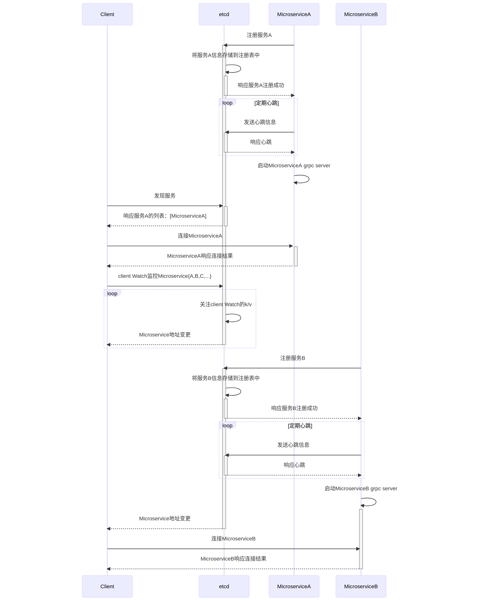

# go-zero etcd服务注册与发现原理

go-zero 利用etcd的动态存取与动态监控能力， grpc的插件式编程动态连接服务的能力， 完成了go-zero可动态伸缩扩展的服务注册与发现。


## go-zero 通过etcd服务注册与发现时序图

图中client代表go-zero grpc client microservice

mircoserviceA,B代表被访问的grpc server. 

A,B是同一个服务不同的部署, A节点先上线， B节点后上线。

忽略了一些细节， 只表达了整体流程， 具体细节下文继续描述.




### 服务配置

1. client服务配置

对应上图中client的配置

```
Name: admin-api
Host: 0.0.0.0
Port: 9000

# 设备
DmsRpc:
  Etcd:
    Hosts:RegisterResolver
      - 10.xxx.xxx.1:2379
      - 10.xxx.xxx.2:2379
      - 10.xxx.xxx.3:2379
    Key: dms.rpc
```

2. server服务配置

对应上图中microserviceA和B的配置

```
Name: dms.rpc
ListenOn: 0.0.0.0:9098

Etcd:
  Hosts:
      - 10.xxx.xxx.1:2379
      - 10.xxx.xxx.2:2379
      - 10.xxx.xxx.3:2379
  Key: dms.rpc
```

### 服务注册流程


1. 构建RpcServer

zrpc/server.go 中NewServer

```
// NewServer returns a RpcServer.
func NewServer(c RpcServerConf, register internal.RegisterFn) (*RpcServer, error) {
	var err error
	if err = c.Validate(); err != nil {
		return nil, err
	}

	var server internal.Server
	metrics := stat.NewMetrics(c.ListenOn)
	serverOptions := []internal.ServerOption{
		internal.WithMetrics(metrics),
		internal.WithRpcHealth(c.Health),
	}
	// 根据是否配置了etcd构建服务，　这个返回的rpc server数据结构实现了internal.Server接口
	if c.HasEtcd() {
		//  构建rpc server以及etcd client
		server, err = internal.NewRpcPubServer(c.Etcd, c.ListenOn, c.Middlewares, serverOptions...)
		if err != nil {
			return nil, err
		}
	} else {
		// 只构建rpc server
		server = internal.NewRpcServer(c.ListenOn, c.Middlewares, serverOptions...)
	}
	// 配置 server name 提供性能检测的名称
	server.SetName(c.Name)
	// 构建rpc server的服务降载， 超时， 鉴权
	if err = setupInterceptors(server, c, metrics); err != nil {
		return nil, err
	}

	rpcServer := &RpcServer{
		server:   server,
		register: register,
	}
	// 构建日志，prometheus， 链路追踪，远程性能报告等
	if err = c.SetUp(); err != nil {
		return nil, err
	}

	return rpcServer, nil
}
```

2. zrpc/internal/rpcpubserver.go中构建实现了RpcServer的keepAliveServer

RpcServer由rpcServer实现， keepAliveServer匿名内部类继承达到实现RpcServer的效果

```
func NewRpcPubServer(etcd discov.EtcdConf, listenOn string, middlewares ServerMiddlewaresConf,
	opts ...ServerOption) (Server, error) {
	registerEtcd := func() error {
		pubListenOn := figureOutListenOn(listenOn)
		var pubOpts []discov.PubOption
		if etcd.HasAccount() {
			pubOpts = append(pubOpts, discov.WithPubEtcdAccount(etcd.User, etcd.Pass))
		}
		if etcd.HasTLS() {
			pubOpts = append(pubOpts, discov.WithPubEtcdTLS(etcd.CertFile, etcd.CertKeyFile,
				etcd.CACertFile, etcd.InsecureSkipVerify))
		}
		if etcd.HasID() {
			pubOpts = append(pubOpts, discov.WithId(etcd.ID))
		}
		pubClient := discov.NewPublisher(etcd.Hosts, etcd.Key, pubListenOn, pubOpts...)
		// 将go-zero配置的grpc server name 和地址通过etcd client 以k/v形式存储到etcd server，
		// 并且通过etcd keepalive监控k/v是否存活， 不存活重新添加
		return pubClient.KeepAlive()
	}
	server := keepAliveServer{
		registerEtcd: registerEtcd,
		Server:       NewRpcServer(listenOn, middlewares, opts...),
	}

	return server, nil
}
```

3. core/discov/publisher.go 中KeepAlive

```
func (p *Publisher) KeepAlive() error {
	// 注册配置中的grpc name/address的k/v到etcd集群
	cli, err := p.doRegister()
	if err != nil {
		return err
	}

	proc.AddWrapUpListener(func() {
		p.Stop()
	})
	// etcd keepalive 键值对续组
	return p.keepAliveAsync(cli)
}

```

core/discov/publisher.go 中doRegister

```
// 注册配置中的grpc name/address
func (p *Publisher) doRegister() (internal.EtcdClient, error) {
	// 构建etcd client 和etcd server的链接， 拿到etcd客户端中的数据，　包括conn链接等，　可以通过客户端发送数据到etcd server
	cli, err := internal.GetRegistry().GetConn(p.endpoints)
	if err != nil {
		return nil, err
	}
	// 将go-zero配置的grpc server name 和地址通过etcd client 以k/v形式存储到etcd server
	p.lease, err = p.register(cli)
	return cli, err
}

func (p *Publisher) register(client internal.EtcdClient) (clientv3.LeaseID, error) {
	resp, err := client.Grant(client.Ctx(), TimeToLive)
	if err != nil {
		return clientv3.NoLease, err
	}

	lease := resp.ID
	if p.id > 0 {
		p.fullKey = makeEtcdKey(p.key, p.id)
	} else {
		p.fullKey = makeEtcdKey(p.key, int64(lease))
	}
	// fullKey 完整key,   config 中grpc server  ${servername}/${listenOnaddress}
	_, err = client.Put(client.Ctx(), p.fullKey, p.value, clientv3.WithLease(lease))

	return lease, err
}
```

core/discov/publisher.go 中keepAliveAsync
```
func (p *Publisher) keepAliveAsync(cli internal.EtcdClient) error {
	//  通过etcd  keepalive 定期续租， 监控是k/v否过期，　保持etcd 配置的活性
	ch, err := cli.KeepAlive(cli.Ctx(), p.lease)
	if err != nil {
		return err
	}

	threading.GoSafe(func() {
		for {
			select {
			case _, ok := <-ch:
				// k/v在etcd被删除， ch被close， 这个时候需要重新将k/v插入
				if !ok {
					p.revoke(cli)
					if err := p.doKeepAlive(); err != nil {
						logx.Errorf("etcd publisher KeepAlive: %s", err.Error())
					}
					return
				}
			case <-p.pauseChan:
				logx.Infof("paused etcd renew, key: %s, value: %s", p.key, p.value)
				p.revoke(cli)
				select {
				case <-p.resumeChan:
					if err := p.doKeepAlive(); err != nil {
						logx.Errorf("etcd publisher KeepAlive: %s", err.Error())
					}
					return
				case <-p.quit.Done():
					return
				}
			case <-p.quit.Done():
				p.revoke(cli)
				return
			}
		}
	})

	return nil
}
```


4. zrpc/internal/rpcserver.go

启动grpc server

```
// 注册rpc服务列表， 构建grpc的配置， 启动grpc server
func (s *rpcServer) Start(register RegisterFn) error {
	lis, err := net.Listen("tcp", s.address)
	if err != nil {
		return err
	}

	unaryInterceptorOption := grpc.ChainUnaryInterceptor(s.buildUnaryInterceptors()...)
	streamInterceptorOption := grpc.ChainStreamInterceptor(s.buildStreamInterceptors()...)

	options := append(s.options, unaryInterceptorOption, streamInterceptorOption)
	// 构建grpc server将grpc 待处理的rpc服务列表注册到grpc server中
	server := grpc.NewServer(options...)
	register(server)

	// register the health check service
	if s.health != nil {
		grpc_health_v1.RegisterHealthServer(server, s.health)
		s.health.Resume()
	}
	s.healthManager.MarkReady()
	health.AddProbe(s.healthManager)

	// we need to make sure all others are wrapped up,
	// so we do graceful stop at shutdown phase instead of wrap up phase
	waitForCalled := proc.AddWrapUpListener(func() {
		if s.health != nil {
			s.health.Shutdown()
		}
		server.GracefulStop()
	})
	defer waitForCalled()

	return server.Serve(lis)
}
```

### 服务发现流程

1. zrpc/client.go 中 NewClient

```
func NewClient(c RpcClientConf, options ...ClientOption) (Client, error) {
	// 构建rpc配置ClientOption
	var opts []ClientOption
	// 是否配置证书
	if c.HasCredential() {
		opts = append(opts, WithDialOption(grpc.WithPerRPCCredentials(&auth.Credential{
			App:   c.App,
			Token: c.Token,
		})))
	}
	if c.NonBlock {
		opts = append(opts, WithNonBlock())
	}
	if c.Timeout > 0 {
		opts = append(opts, WithTimeout(time.Duration(c.Timeout)*time.Millisecond))
	}
	if c.KeepaliveTime > 0 {
		opts = append(opts, WithDialOption(grpc.WithKeepaliveParams(keepalive.ClientParameters{
			Time: c.KeepaliveTime,
		})))
	}

	opts = append(opts, options...)
	// 根据配置， 获取rpc server地址， 一种是直连配置， 一种是etcd配置
	target, err := c.BuildTarget()
	if err != nil {
		return nil, err
	}

	client, err := internal.NewClient(target, c.Middlewares, opts...)
	if err != nil {
		return nil, err
	}

	return &RpcClient{
		client: client,
	}, nil
}
```

2. zrpc/config.go 中 BuildTarget()

构建grpc DiscovTarget, 在grpc client连接过程中， 会通过这个target来获取 go-zero实现的grpc client的resolver Builder，resolver Builder接口是grpc提供的一个接口， 可以让外部实现Builder接口， 然后通过 grpc提供的全局map变量注册进来， 以供grpc连接的时候可以使用外部给的server地址.

```
func (cc RpcClientConf) BuildTarget() (string, error) {
	//构建直连地址
	if len(cc.Endpoints) > 0 {
		return resolver.BuildDirectTarget(cc.Endpoints), nil
	} else if len(cc.Target) > 0 {
		return cc.Target, nil
	}

	if err := cc.Etcd.Validate(); err != nil {
		return "", err
	}

	if cc.Etcd.HasAccount() {
		discov.RegisterAccount(cc.Etcd.Hosts, cc.Etcd.User, cc.Etcd.Pass)
	}
	if cc.Etcd.HasTLS() {
		if err := discov.RegisterTLS(cc.Etcd.Hosts, cc.Etcd.CertFile, cc.Etcd.CertKeyFile,
			cc.Etcd.CACertFile, cc.Etcd.InsecureSkipVerify); err != nil {
			return "", err
		}
	}
	// 构建grpc DiscovTarget， 格式： etcd://10.xxx.xxx.1,10.xxx.xxx.2,10.xxx.xxx.3/grpc serverName
	return resolver.BuildDiscovTarget(cc.Etcd.Hosts, cc.Etcd.Key), nil
}
```

3. zrpc/internal/client.go 中 NewClient

NewClient dial连接 grpc server

```
func NewClient(target string, middlewares ClientMiddlewaresConf, opts ...ClientOption) (Client, error) {
	cli := client{
		middlewares: middlewares,
	}
	// 负载均衡策略 p2c
	svcCfg := fmt.Sprintf(`{"loadBalancingPolicy":"%s"}`, p2c.Name)
	balancerOpt := WithDialOption(grpc.WithDefaultServiceConfig(svcCfg))
	opts = append([]ClientOption{balancerOpt}, opts...)
    // dial 连接grpc server
	if err := cli.dial(target, opts...); err != nil {
		return nil, err
	}

	return &cli, nil
}
```

4. zrpc/resolver/register.go中 Register()

```
// 这里是注册grpc的resolver， 将特定schema和实现了grpc-go 接口的resolver Builder 通过grpc-go的Register注册到库中的全局变量中
// 在grpc连接的时候， grpc库会通过这个实现的Builder接口获取到服务的直连地址或者etcd中的动态地址
func Register() {
	internal.RegisterResolver()
}

```

5. zrpc/resolver/internal/resolver.go中 RegisterResolver()

```
// RegisterResolver registers the direct and discov schemes to the resolver.
// 注册grpc直连地址和etcd链接正常的服务地址到grpc的解析器, 将resolver注册到grpc-go的库中的一个全局变量当中，
// 在go-zero grpc client连接服务的时候， 依然使用的这个库， 所以这样就关联到一起了。
func RegisterResolver() {
    // 这里的Register即是 grpc库中的 Builder注册函数， 将Builder注册到grpc库中
	resolver.Register(&directResolverBuilder)
	resolver.Register(&discovResolverBuilder)
	resolver.Register(&etcdResolverBuilder)
	resolver.Register(&k8sResolverBuilder)
}
```

6. zrpc/resolver/internal/etcdbuilder.go 

这里的EtcdScheme即是grpc Builder注册的name， 和 BuildTarget中使用的是同一个Scheme， 即etcd， 在grpc 连接的时候， 可以索引到这个Builder

```
type etcdBuilder struct {
	discovBuilder
}

func (b *etcdBuilder) Scheme() string {
	return EtcdScheme
}
```

7. zrpc/resolver/internal/discovbuilder.go 中 Build()

这里是真实的grpc库中使用的resolver Builder的实现， 当grpc client连接server的时候， 会通过这个Build函数来获取server地址

```
// 当每个go-zero业务服务grpc client连接 server的时候会调用一次Build， grpc-go内部会在获取服务地址的时候会调用Build
func (b *discovBuilder) Build(target resolver.Target, cc resolver.ClientConn, _ resolver.BuildOptions) (
	resolver.Resolver, error) {
	// 拆分地址字符串，获取etcd集群地址 endpoints
	hosts := strings.FieldsFunc(targets.GetAuthority(target), func(r rune) bool {
		return r == EndpointSepChar
	})

	// targets.GetEndpoints(target)：获取配置中的etcd的key值， 根据key值监控这个go-zero的grpc sever
	// NewSubscriber：对etcd中存储的go-zero的grpc server动态监控， 如果有变化， 则通过下面的update更新grpc server的地址，
	// 然后通过 grpc client中的UpdateState 更新地址，动态重连 grpc server
	sub, err := discov.NewSubscriber(hosts, targets.GetEndpoints(target))
	if err != nil {
		return nil, err
	}

	update := func() {
		var addrs []resolver.Address
		for _, val := range subset(sub.Values(), subsetSize) {
			addrs = append(addrs, resolver.Address{
				Addr: val,
			})
		}
		// UpdateState是grpc库中的地址更新函数，第一次grpc 链接的时候， 通过UpdateState连接grpc server， 后续通过这个函数更新grpc server地址， 重连server
		if err := cc.UpdateState(resolver.State{
			Addresses: addrs,
		}); err != nil {
			logx.Error(err)
		}
	}
	// 在监控中添加这个update回调函数， 以供动态更新grpc server连接
	sub.AddListener(update)
	// 这里是第一次 go-zero中 grpc client 连接 server的时候使用
	update()

	return &nopResolver{cc: cc}, nil
}
```

8. core/discov/subscriber.go中 NewSubscriber

这里会在第一次grpc连接的时候获取server地址， 并通过etcd集群启动对server的k/v的监控（Monitor函数）

```
// key值是go-zero中启动的grpc服务在etcd中的key值
func NewSubscriber(endpoints []string, key string, opts ...SubOption) (*Subscriber, error) {
	sub := &Subscriber{
		endpoints: endpoints,
	}
	for _, opt := range opts {
		opt(sub)
	}
    // 创建一个Container， Container持有了grpc的updatestate函数， 并维护了grpc server地址， 地址变更， 通过updatestate重连
	sub.items = newContainer(sub.exclusive)
	// 监控etcd集群， 这里的Registry监控部分是当前服务中可能有的多个grcp client共有的, Subscriber以及container都是单个grpc client独有的.
	if err := internal.GetRegistry().Monitor(endpoints, key, sub.items); err != nil {
		return nil, err
	}

	return sub, nil
}
```

9. core/discov/internal/registry.go 中 Monitor函数

```
// 同一个go-zero client端可能需要连接多个grpc server， 这里会被调用多次， 所以， 已经有的etcd集群数据会被重复利用， 这里看似有些不必要的代码， 其实是为了多个grpc client复用准备的。
func (r *Registry) Monitor(endpoints []string, key string, l UpdateListener) error {
	c, exists := r.getCluster(endpoints)
	// if exists, the existing values should be updated to the listener.
	// 如果grpc client连接多个grpc server， 监控只在grpc client启动的， 第一次连接监控和etcd client连接都是是不存在的，
	// 第一次会创建监控和etcd 连接， 后续的grpc client如果etcd地址一样，会直接复用第一次的etcd client链接和Registry
	if exists {
		// 根据配置中grpc server name 获取已经存在的go-zero grpc server地址
		kvs := c.getCurrent(key)
		for _, kv := range kvs {
			// 这里的UpdateListener也只是其中一个grpc客户端的UpdateListener
			l.OnAdd(kv)
		}
	}
    // 启动对etcd中注册服务的监控
	return c.monitor(key, l)
}

```

```

// 根据go-zero grpc client中配置的多个grpc server， 每个都会启动一个monitor监控
func (c *cluster) monitor(key string, l UpdateListener) error {
	c.lock.Lock()
	// 将同一个server中所有的grpc client UpdateListener添加到cluster listeners列表
	c.listeners[key] = append(c.listeners[key], l)
	c.lock.Unlock()
	// 获取etcd client 和 server的grpc连接客户端， 如果连接不存在， 新建连接， 存在的话， 复用之前的链接
	cli, err := c.getClient()
	if err != nil {
		return err
	}
	// 获取最新的grpc地址， 如果地址有变动， 重连， 同时得到最新的修改记录，在下面的watch监控动态变化.
	rev := c.load(cli, key)
	// 监控最新的修改版本， 如有改动， 更新地址， 重连grpc server
	// 同一个server中多个grpc client， 每一个都会启动一个watch，本质是一个waitGroup add一个任务.
	c.watchGroup.Run(func() {
		c.watch(cli, key, rev)
	})

	return nil
}
```

```

func (c *cluster) watch(cli EtcdClient, key string, rev int64) {
	for {
		if c.watchStream(cli, key, rev) {
			return
		}
	}
}

// 实时监控etcd server集群中的k/v变化
func (c *cluster) watchStream(cli EtcdClient, key string, rev int64) bool {
	var rch clientv3.WatchChan
	if rev != 0 {
		// 监控最新的修改记录， 如果有变动， 会在channel收到数据， 下面for循环处理.
		rch = cli.Watch(clientv3.WithRequireLeader(c.context(cli)), makeKeyPrefix(key), clientv3.WithPrefix(),
			clientv3.WithRev(rev+1))
	} else {
		rch = cli.Watch(clientv3.WithRequireLeader(c.context(cli)), makeKeyPrefix(key), clientv3.WithPrefix())
	}

	for {
		select {
		case wresp, ok := <-rch:
			if !ok {
				logx.Error("etcd monitor chan has been closed")
				return false
			}
			if wresp.Canceled {
				logx.Errorf("etcd monitor chan has been canceled, error: %v", wresp.Err())
				return false
			}
			if wresp.Err() != nil {
				logx.Error(fmt.Sprintf("etcd monitor chan error: %v", wresp.Err()))
				return false
			}
			// etcd中的k/v发生变化， 将grpc server地址变化更新到每一个grpc client的updateState函数中， 重连.
			c.handleWatchEvents(key, wresp.Events)
			// 这里channel done 在etcd连接断开以后， 会收到 close (done)的关闭消息， 收到的是0值， 关闭当前监听
		case <-c.done:
			return true
		}
	}
}
```


```
// 处理etcd集群中k/v变化， 当有新的grpc server上线的时候， 会put key/address 到etcd集群，
// 当旧的grpc客户端连接监控收到的时候， 会更新本地的 grpc server地址， 进而通过listeners回调grpc的updateState函数重连
func (c *cluster) handleWatchEvents(key string, events []*clientv3.Event) {
	c.lock.Lock()
	// 重置listeners中的key的UpdateListener列表
	listeners := append([]UpdateListener(nil), c.listeners[key]...)
	c.lock.Unlock()

	for _, ev := range events {
		switch ev.Type {
		case clientv3.EventTypePut:
			c.lock.Lock()
			if vals, ok := c.values[key]; ok {
				vals[string(ev.Kv.Key)] = string(ev.Kv.Value)
			} else {
				c.values[key] = map[string]string{string(ev.Kv.Key): string(ev.Kv.Value)}
			}
			c.lock.Unlock()
			// 更新Container中的地址， 重连grpc server
			for _, l := range listeners {
				l.OnAdd(KV{
					Key: string(ev.Kv.Key),
					Val: string(ev.Kv.Value),
				})
			}
		case clientv3.EventTypeDelete:
			c.lock.Lock()
			if vals, ok := c.values[key]; ok {
				delete(vals, string(ev.Kv.Key))
			}
			c.lock.Unlock()
			// 更新Container中的地址， 重连grpc server
			for _, l := range listeners {
				l.OnDelete(KV{
					Key: string(ev.Kv.Key),
					Val: string(ev.Kv.Value),
				})
			}
		default:
			logx.Errorf("Unknown event type: %v", ev.Type)
		}
	}
}
```


## 总结

1. go-zero grpc server 利用配置文件中grpc name/address作为k/v注册到etcd
2. go-zero grpc client 利用配置文件中grpc name作为key从etcd中获取 grpc server地址， 并对etcd中存储的grpc server地址动态监控
3. go-zero grpc client 利用grpc自身插件式编程的方式， 将本地实现的grpc resolver Builder接口注册到grpc的全局map变量， 拿到UpdateState， 将本地etcd监控的server地址变更结果， 通过UpdateState动态更新grpc client和grpc server的连接

这样一个过程实现了动态服务注册， 动态服务发现， 可以在不改变原有部署服务的前提下， 快速扩展微服务节点以适应业务的快速增长.